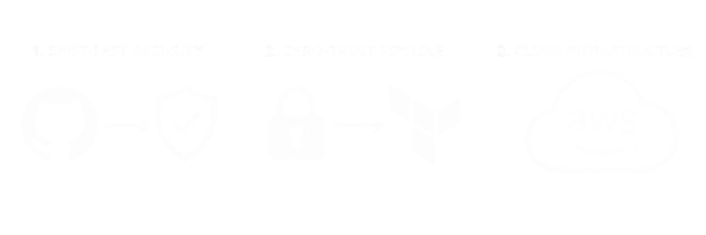
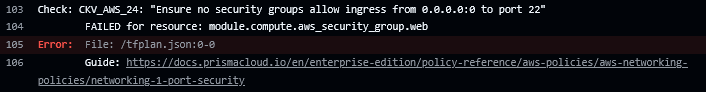
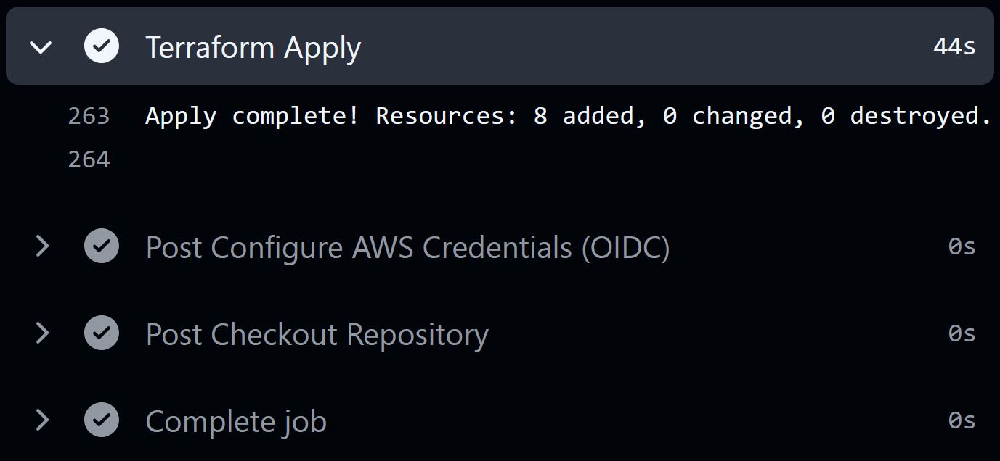
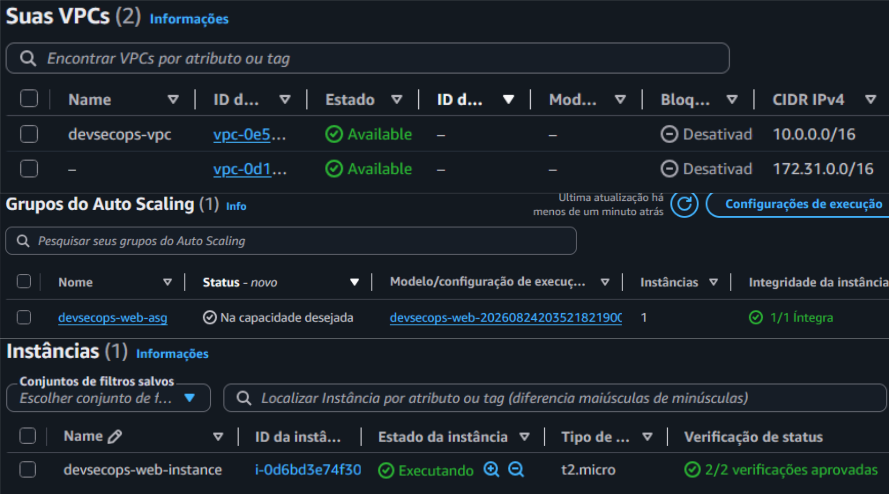
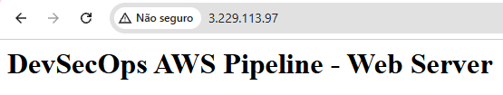

# DevSecOps AWS: Pipeline de IaC Segura


Projeto prático de infraestrutura como código (IaC) na AWS com foco em segurança (Shift-Left) e automação de CI/CD. O objetivo é provisionar um ambiente com VPC, Security Groups e Auto Scaling Group no Free Tier, garantindo autenticação sem credenciais estáticas (OIDC) e análise estática de segurança com Checkov antes do deploy.

---

## Arquitetura

O fluxo de CI/CD foi estruturado no GitHub Actions com autenticação federada via OpenID Connect (OIDC):

* **Pull Requests:** A esteira autentica temporariamente na AWS, gera o plano do Terraform (`tfplan`) e executa a análise estática de vulnerabilidades com Checkov. Se houver falhas de segurança, o merge é bloqueado.
* **Push na branch `main`:** Após validação e merge, a pipeline executa o `terraform apply` provisionando a infraestrutura na AWS.

<p align="center">
  
</p>

---

## Evidências de Execução

### 1. Bloqueio Preventivo com Checkov (Shift-Left)
Validação de segurança bloqueando um PR após detectar uma regra de Security Group exposta indevidamente:

<p align="center">
  
</p>

### 2. Execução da Pipeline de Deploy
Deploy automatizado na branch principal via GitHub Actions utilizando autenticação OIDC (sem `AWS_ACCESS_KEY_ID` / `AWS_SECRET_ACCESS_KEY` estáticas):

<p align="center">
  
</p>

### 3. Recursos Provisionados na AWS
Instâncias EC2 inicializadas via Auto Scaling Group com tags e configurações de rede gerenciadas pelo Terraform:

<p align="center">
  
</p>

### 4. Validação Funcional da Aplicação
Servidor web Apache inicializado via script de *User Data* e respondendo na porta 80:

<p align="center">
  
</p>

---

## Decisões Técnicas

* **Autenticação OIDC:** Elimina o uso de credenciais de longa duração no repositório. O GitHub Actions assume temporariamente uma IAM Role com permissões de menor privilégio (*Least Privilege*).
* **Terraform S3 Native State Locking:** Utilização do recurso nativo de bloqueio de estado do Terraform 1.10+ diretamente no S3, dispensando a necessidade de uma tabela DynamoDB dedicada para controle de locks.
* **Modularização:** Divisão da infraestrutura em módulos reutilizáveis (`network` e `compute`) em `./modules` consumidos pelo ambiente `./environments/dev`.
* **Alta Disponibilidade com Auto Scaling:** Utilização de Launch Template e Auto Scaling Group para substituição automática de instâncias em caso de falha.
* **Nota sobre HTTP vs Custos (Free Tier):** A aplicação responde em HTTP (porta 80) para manter o laboratório com custo zero. A implementação de terminação TLS/HTTPS exigiria um Application Load Balancer (ALB) e registro de domínio no Route 53/ACM, gerando custos fora do escopo deste laboratório focado na segurança da esteira de CI/CD.

---

## Como Reproduzir

1. **Configurar OIDC no IAM:**
   * Crie um *Identity Provider* OIDC no IAM para `token.actions.githubusercontent.com` com audience `sts.amazonaws.com`.
   * Crie uma IAM Role associada à Trust Policy do seu repositório GitHub e adicione as permissões necessárias para gerenciar VPC e EC2.
2. **Backend Remoto:**
   * Crie um bucket S3 privado com versionamento habilitado e ajuste o nome do bucket em `environments/dev/providers.tf`.
3. **Configurar GitHub Secret:**
   * Crie a secret `AWS_ROLE_ARN` no repositório com o ARN da Role criada.
4. **Deploy:**
   * Crie um Pull Request para testar o scan do Checkov ou faça o push na branch `main` para aplicar a infraestrutura.

## Descomissionamento

Para destruir todos os recursos criados:

```bash
cd environments/dev
terraform init
terraform destroy -auto-approve
```
